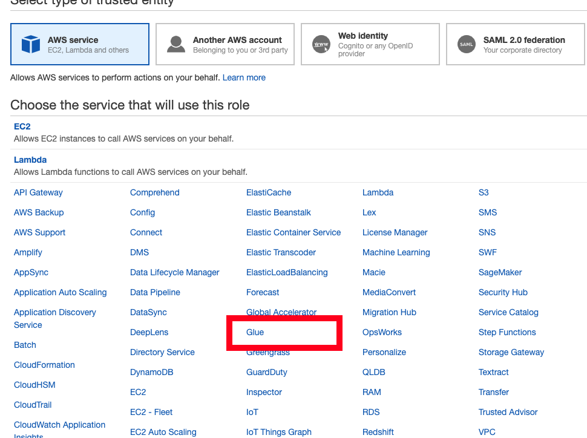
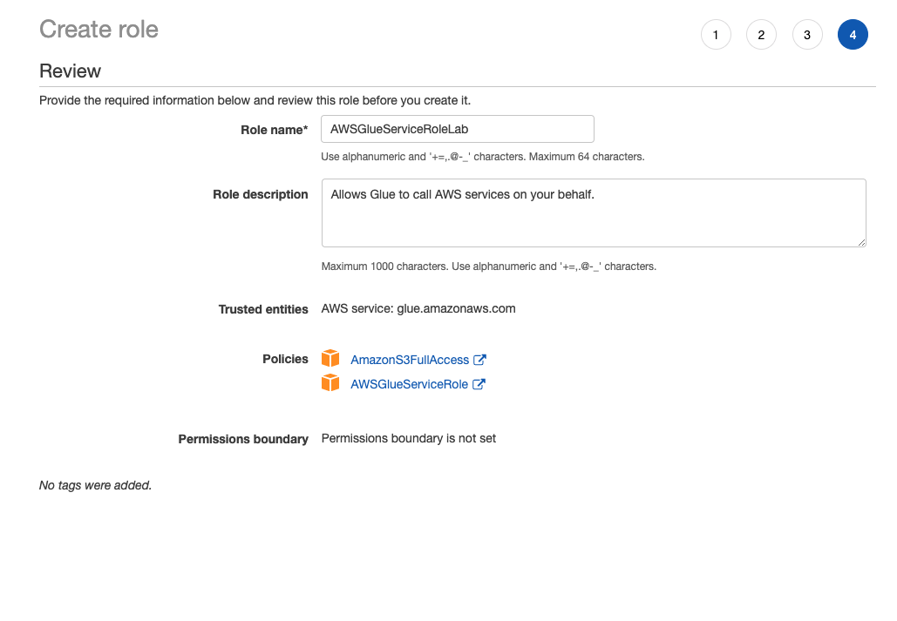

# Part 3 : Catalog 
In this Lab, we will explore using Glue for serverless ETL. We will be using the data previously stored in S3: **YOUR_USERNAME-datalake-demo-bucket** and to make it queriable using standard SQL. 

## 1. Create IAM Role

First, we will create an IAM Role for the Glue service to access our source data. Glue will also require permissions to create additional entities and datasets in its catalog. 

* Go to the IAM console: https://console.aws.amazon.com/iam/home?region=us-east-1#/roles. On the navigation bar on the left, select **Roles**.
* Click - **Create role**
    * Select type of trusted entity: **AWS Service**
    * Choose the service that will use this role: **Glue**
        

    * Click - **Next: Permissions**
    * Check **two (2)** permissions: **AmazonS3FullAccess** and **AWSGlueServiceRole**
    * Click - **Next: Tags**
	    * Leave as default, no changes here
    * Click - **Next: Review**
    * Role name: **AWSGlueServiceRoleLab**
    * make sure that are two policies attached to this role (**AmazonS3FullAccess**, **AWSGlueServiceRole**)
    * Click - **Create role**
    

You will later use this Role *AWSGlueServiceRoleLab* for running Glue tasks.

## Create AWS Glue Crawlers

In this step, we will navigate to AWS Glue Console & create glue crawlers to discovery the newly ingested data in S3.

* GoTo: https://console.aws.amazon.com/glue/home?region=us-east-1
* On the left panel, click on **Crawlers** > Click on **Add Crawler**
    * Crawler info
        * Crawler name: **summitcrawler**
        * Click - **Next**
    * Data store
        * Data store: **S3**
        * Crawl data in: **Specified path in my account**
        * Include path: **s3://yourname-datalake-demo-bucket/data/**
        * Click - **Next**
        * Add another data store : **No**
        * Click - **Next**
    * IAM Role
        * Choose: **Create an IAM role**
        * Role Name: **AWSGlueServiceRoleLab**
        * Click - **Next**
    * Schedule
        * Frequency: **Run on demand**
        * Click - **Next**
    * Output
        * Click - Add database
        * Database name: **summitdb**
        * Click - **Create**
        * Click - **Next**
    * Review all steps
        * Review the configuration & make sure its as mentioned above
        * Click - **Finish**
* You should see a message : Crawler summitcrawler was created to run on demand.
    * Click - **Run on demand** This will run the crawler
    * Wait for few minutes

## Verify newly created tables in catalog

Navigate to Glue Catalog & explore the crawled data:

* GoTo : https://console.aws.amazon.com/glue/home?region=us-east-1#catalog:tab=databases 
    * Click - **summitdb**
* Click - **Tables in summitdb**
    * Click - **raw**
    * Look around and explore the schema for your dataset
        * look for the `averageRecordSize`, `recordCount`, `compressionType`

## Query ingested data using Amazon Athena

Lets query newly ingested data using Amazon Athena

* GoTo : https://us-east-1.console.aws.amazon.com/athena/home?region=us-east-1#query
* On the left panel (**Database**) drop down , select **summitdb** > select table **raw**
* Click on **3 dots** (3 vertical dots) > Select **Preview Table**
* Review the output 
* In query editor, paste the following query > Click on **Run Query**

```
SELECT activity_type,
         count(activity_type)
FROM raw
GROUP BY  activity_type
ORDER BY  activity_type
```


