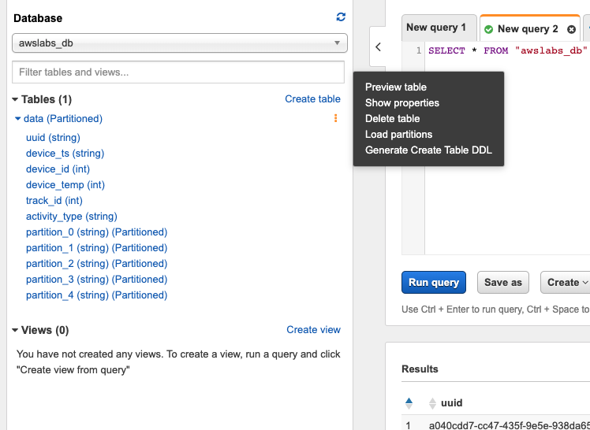

# Part 3 : Catalog 
In this Lab, we will explore using Glue for serverless ETL. We will be using the data previously stored in S3: **YOUR_USERNAME-datalake-demo-bucket** and to make it queriable using standard SQL. 

## 1. Create IAM Role

First, we will create an IAM Role for the Glue service to access our source data in S3.
Glue will also require permissions to create additional entities and datasets in its catalog. 

* Go to the IAM console: https://console.aws.amazon.com/iam/home?region=us-east-1#/roles. On the navigation bar on the left, select **Roles**.
* Click - **Create role**
    * Select type of trusted entity: **AWS Service**
    * Choose the service that will use this role: **Glue**
        

    * Click - **Next: Permissions**
    * Check **two (2)** permissions: **AmazonS3FullAccess** and **AWSGlueServiceRole**
    * Click - **Next: Tags**
	    * Leave as default, no changes here
    * Click - **Next: Review**
    * Role name: **AWSGlueServiceRoleLab**
    * make sure that are two policies attached to this role (**AmazonS3FullAccess**, **AWSGlueServiceRole**)
    * Click - **Create role**
    

You will later use this Role *AWSGlueServiceRoleLab* for running Glue tasks.

## 2. Discover raw data with AWS Glue Crawlers

Glue Crawlers (not a web crawler) are a way to populate Glue data tables from files and database tables. 

In this step, we will create Crawlers to discover the schema and structure of data stored in our S3 bucket.

* Access the Glue console: https://console.aws.amazon.com/glue/home?region=us-east-1
* On the left navigation panel, click on **Crawlers** >, and then **Add Crawler** to create a crawler.
    * Crawler info
        * Crawler name: **CrawlDataFromKDG**
        * Click - **Next**
    * Crawler source type: **Data Stores**. 
    	* Next
    * Choose a data store
        * Data stores: **S3**
        * Crawl data in: **Specified path in my account**
        * Include path: **s3://YOUR_USERNAME-datalake-demo-bucket/data/**
        * Click - **Next**
        * Add another data store : **No**
        * Click - **Next**
    * Choose an IAM Role
        * Choose: **Choose an existing IAM Role**
        * Role Name: **AWSGlueServiceRoleLab**
        * Click - **Next**
    * Schedule
        * Frequency: **Run on demand**
        * Click - **Next**
    * Configure the crawler's output
        * Click - Add database
        * Database name: **awslabs_db**
        * Click - **Create**
        * Click - **Next**
    * Review all steps
        * Review the configuration & make sure its as mentioned above
        * Click - **Finish**
* You should see a message : *"Crawler **CrawlDataFromKDG** was created to run on demand. Run it now?"*
    * Click on **Run it now?** to run the crawler immediately.
    * Wait for few minutes. *Crawler CrawlDataFromKDG is running*
    * Continue when the crawler Status has changed to *Stopping* and back to *Ready*
    
    
    

## 3. Verify newly created tables in our Glue Catalog.

Let's view the data we crawled with Glue. The data is available as a Glue Database and Table.

* On the navigation on the left, select **Databases**
    * Click on **awslabs_db**
* Let's view the tables and their contents in this database. 
    * Click on **Tables in summitdb**. There is table named **data**.
    * View the data table. Explore the table schema for your dataset and see that it matches your expected schema and size.
    * Inspect the values for `averageRecordSize`, `recordCount`, `compressionType`
    
Your JSON data in s3 is now a relational dataset in the form of a Glue Database and Table.
How can we query the data table?
    
## 4. Analyze Glue tables using AWS Athena

Lets query Glue tables using Athena.

* Open the Athena console : https://us-east-1.console.aws.amazon.com/athena/home?region=us-east-1#query
* On the left panel (**Database**) drop down , select **awslabs_db** > select table **data**
* Click on **3 dots** (3 vertical dots) > Select **Preview Table**
    

* View the SQL statement printed on the console on the right. 
    * `SELECT * FROM "awslabs_db"."data" limit 10;` - what does this query do?
    
* Click on **Run Query** to execute the query. What do you printed out in the Results section?
* Paste the follow SQL query in the editor:

	```
	SELECT activity_type,
		 count(activity_type)
	FROM raw
	GROUP BY  activity_type
	ORDER BY  activity_type
	```
* How many counts do you have for the following activites: *Traveling* and *Running*? Share this with your instructor.

## Extra 2: Analyze Glue tables using SQL clients


