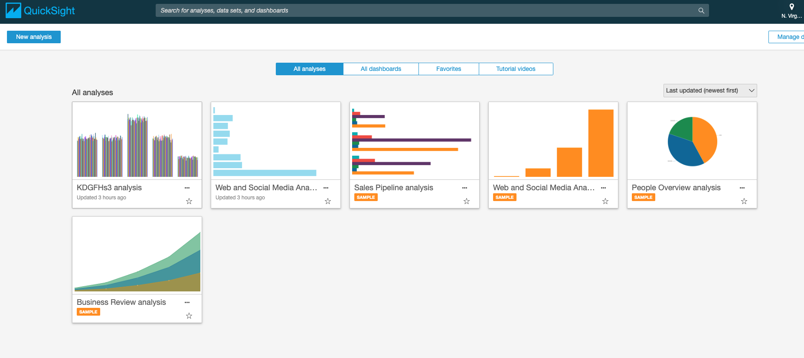
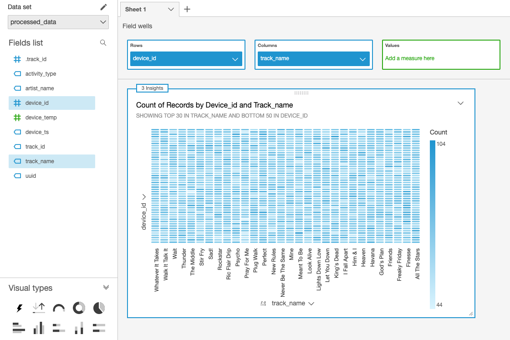
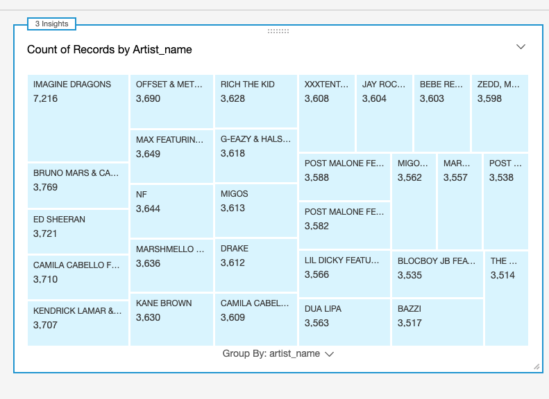

# Part 5: Visualize

## Setting Up QuickSight
In this step we will visualize it using QuickSight

Login to Amazon Quick Sight Console & complete the registration & sign-up

* GoTo: https://us-east-1.quicksight.aws.amazon.com/sn/start
* You may be asked to Sign Up for Quicksight. Proceed to Create your QuickSight account with an Enterprise plan.
* Create your QuickSight account:
	* Edition: **Use Role Based Federation(SSO)**
	* QuickSight region: **US East (N. Virginia)**
	* QuickSight account name: **YOUR_USERNAME**
	* Check the following:
		* Enable autodiscover of data and users in your Amazon Redshift....
		* Amazon Athena
		* Amazon S3: Select **YOUR_USERNAME-datalake-demo-bucket** > **Select buckets**
		* **Go to Amazon Quicksight**
		
Welcome to the QuickSight console!

## Adding a New Dataset

* GoTo: https://us-east-1.quicksight.aws.amazon.com/sn/start
* On top right, Click - **Manage Data**
    * Click - **New Data Set**
    * Click - **Athena** 
    * New Athena data source
        * Data source name: **awslabs_db**
    * Choose your table:
        * Database: contain sets of tables: select - **awslabs_db**
        * Tables: contain the data you can visualize : select - **processed_data**
        * Click - **Select**
    * Finish data set creation:
        * Select - **Directly query your data**
	* SPICE is Amazon QuickSight's in-memory optimized calculation engine, designed specifically for fast, ad hoc data visualization
        * Click **Visualize**

## Using Amazon Quick Sight to Visualize Our Processed Data

###  Visualization 1: Heat map of users and tracks they are listening to

In this step, we will create a visualization that show us which users are listening to repetitive tracks

* On the bottom-left panel - **Visual types**
    * Hover on icon there to see names of the visualizations
    * Click on - **Heat Map**
* On top-left panel - **Fields list**
    * Click -  **device_id**
    * Click - **track_name**
* Just above the visualization you should see **Field wells** : [**Rows - device_id**] [**Columns - track_name**]

If you hover on dark blue patches on the heatmap you will see that those particular users are listening to same track repeatedly.

### Visualization 2: Tree map of most played Artist Names

In this step we will create a visualization that shows who are the host played artists

* On top-left - Click on '**+ Add**' > **Add Visual**, this will add a new panel to the right pane
* On the bottom-left panel - **Visual types**
    * Hover on icon there to see names of the visualizations
    * Click on - **Tree Map**
* On top-left panel - **Fields list**
    * Click - **artist_name**

Play around and explore Amazon QuickSight Console. Try out filters, other visualization types, etc.

